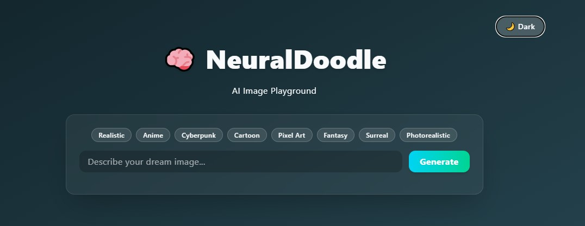

# 🧠 NeuralDoodle - AI Image Playground

[](https://reactjs.org/)
[](https://tailwindcss.com/)
[](https://vitejs.dev/)
[](LICENSE)

**Transform text prompts into stunning artwork** with style selection. Built with React and Tailwind CSS.


## 🌟 For Everyone Star the repo if you like it! ⭐

## ✨ Key Features
- **AI-Powered Image Generation** from text prompts
- **Multiple Art Styles**: Anime, Oil Painting, Pixel Art, etc.
- **Real-Time Preview** of generated images
- **Mobile-Friendly** responsive design
- **One-Click Download** (PNG/JPEG)

## 🛠 Tech Stack
| Frontend       | Styling       | Build Tool |
|----------------|---------------|------------|
| React 19       | Tailwind CSS  | Vite 4     |
| React Hook Form| Framer Motion | ESLint     |
| Zustand        | Headless UI   | Prettier   |

## 🚀 Installation
```bash
# Clone the repository
git clone https://github.com/Adytia855/Neural-Doodle.git

# Navigate to project directory
cd Neural-Doodle

# Install dependencies
npm install

# Start development server
npm run dev
```

## 🎨 Tailwind CSS Features Used
- **Responsive utilities**: `md:`, `lg:` prefixes  
  
- **Custom animations**:  
  
- **Color system**:  

- **Dark mode support**:  


## 📂 Project Structure

```bash
NeuralDoodle/
├── public/                  # Static assets
│   ├── neural.jpg           # Example output image
│   └── neural.svg           # Brand/logo SVG
│
├── src/
│   ├── assets/              # Design assets
│   ├── components/          # React components
│   │   ├── Footer.jsx       # Page footer
│   │   ├── ImageGenerator.jsx  # Main AI generator UI
│   │   └── Loader.jsx       # Loading animation
│   │
│   ├── utils/               # Helper functions
│   │   ├── generateImage.js # AI image generation logic
│   │   ├── storage.js       # LocalStorage utilities
│   │   └── theme.js         # Dark/light mode handler
│   │
│   ├── App.jsx              # Root component
│   ├── index.css            # Global Tailwind imports
│   └── main.jsx            # Entry point
│
├── .env                     # Environment variables
├── .gitignore               # Git exclusion rules
├── eslint.config.js         # ESLint configuration
├── index.html               # HTML template
├── package.json             # Project manifest
└── vite.config.js           # Build configuration
